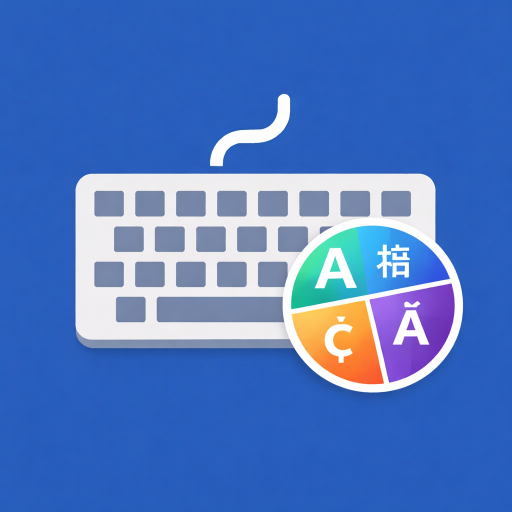
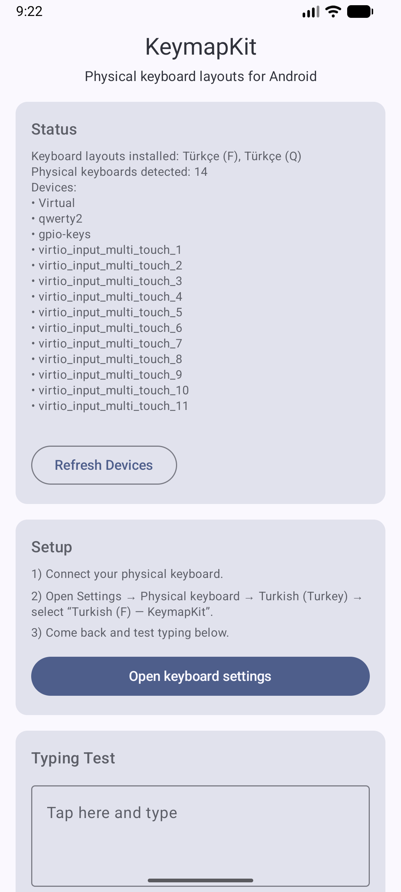
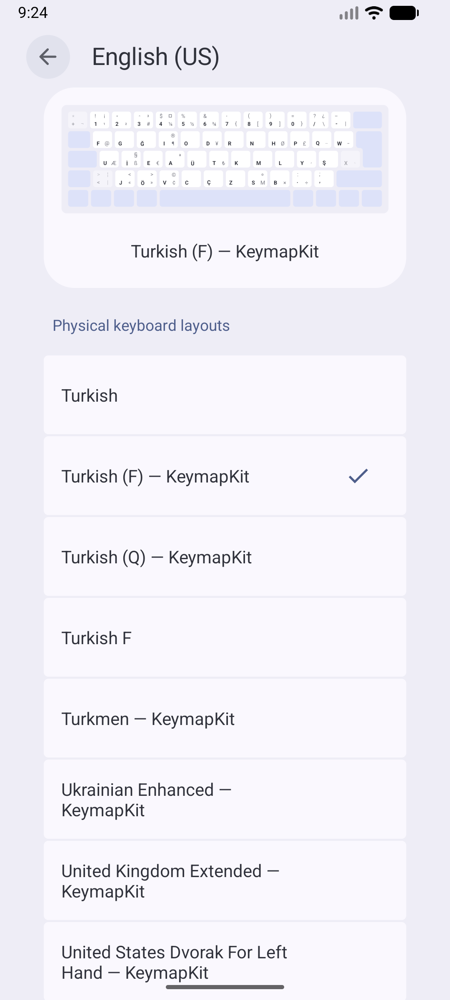
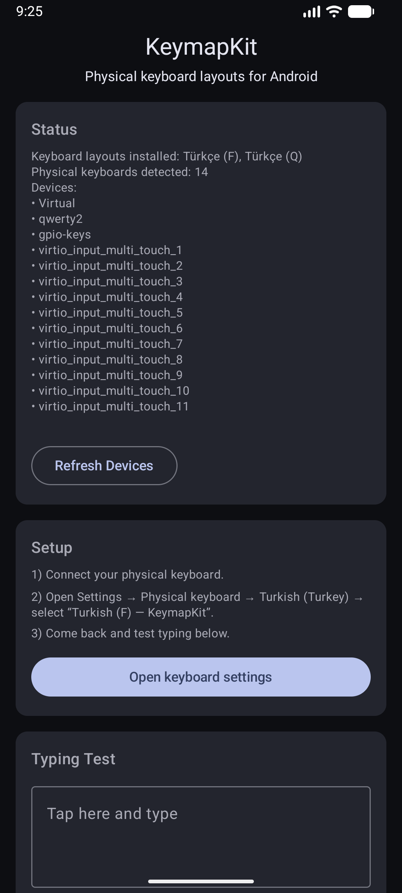

  

  

# KeymapKit

  <strong>Physical keyboard layouts for Android</strong> 
  Turkish (F), Turkish (Q) and more — system-level, no IME.

**KeymapKit** is a lightweight Android utility that adds **physical keyboard layouts** (such as **Turkish F**) to the system — **without root, without permissions, and without acting as an on-screen keyboard**.

> This app is **not** a software keyboard (IME).  
> It only provides **hardware (physical) keyboard layouts** at the system level.

---

## 📸 Screenshots

  
  
  
  

**What you see above:**
- Main screen with status and setup steps
- Typing test to verify the selected layout
- System Settings → Physical keyboard showing KeymapKit layouts
- Dark mode support (Material You)

---

## ✨ Features

- ✅ Adds physical keyboard layouts
- ✅ Works system-wide (all apps)
- ✅ No root required
- ✅ No permissions required
- ✅ Offline, lightweight, privacy-friendly
- ✅ Modern **Material You (Dynamic Color)** UI
- ✅ Supports Android 8.0+ (API 26+)

---

## 🧠 How It Works

Android supports physical keyboard layouts via `.kcm` (Key Character Map) files.

KeymapKit:
- Registers itself as a **keyboard layout provider**
- Supplies `.kcm` layout definitions to the system
- Lets users select layouts from **System Settings → Physical keyboard**

No input method, accessibility service, or special permission is used.

---

## 📱 Setup & Usage

1. **Connect your physical keyboard** (USB or Bluetooth)
2. Open **Settings → Physical keyboard**
3. Tap **Turkish (Türkiye)**
4. Select **“Türkçe (F) — KeymapKit”**
5. Open KeymapKit and test typing 🎉

> On some Samsung devices, you must tap the language row (e.g. *Türkçe (Türkiye)*) to see layout variants.

---

## 🛡️ Privacy & Permissions

- 🔒 **No permissions requested**
- 📡 No network access
- 👁️ No data collection
- 🧾 No analytics or trackers

KeymapKit only exposes static keyboard layout resources to the Android system.

---

## 🧪 Debug & Verification

The app includes a built-in **typing test and debug screen**:
- Verify that the selected layout works correctly
- Inspect key events if something feels off
- Useful for troubleshooting different keyboard models

---

## 🧩 Supported Layouts

Currently included:
- 🇹🇷 Turkish (F)
- 🇹🇷 Turkish (Q)

Planned:
- 🇺🇸 English (US)
- 🇩🇪 German
- 🇫🇷 French
- More layouts via an open generator pipeline

---

## 🧑‍💻 Tech Stack

- **Kotlin**
- **Jetpack Compose**
- **Material 3 / Material You**
- Android Keyboard Layout API (`.kcm`)
- No legacy views, no XML UI

---

## 📄 Third-Party Notice

Some keyboard layout data (`.kcm` files) are derived from the open-source project:

**More Physical Keyboard Layouts / extra-keyboard-layouts**  
License: MIT License

See [`THIRD_PARTY_NOTICES.md`](THIRD_PARTY_NOTICES.md) for details.

---

## 📦 Play Store

KeymapKit is published on Google Play as a lightweight system utility.

- No root required
- No permissions
- No accessibility usage
- Not an on-screen keyboard (IME)

👉 **Get it on Google Play:**  
https://play.google.com/store/apps/details?id=com.alpware.kodex

---

## 📜 License

Apache License 2.0

You are free to use, modify, and distribute this project under the terms of the license.

---

## 🤝 Contributing

Contributions are welcome!

- Bug reports
- New keyboard layouts
- Documentation improvements
- Generator tools for `.kcm` files

Feel free to open an issue or pull request.

---

## ✉️ Contact

Developed by **AlpWare Studio**  
If you have feedback or layout requests, feel free to open an issue.

---

**KeymapKit — because physical keyboards deserve proper layouts.**