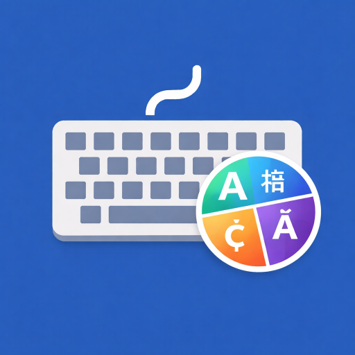
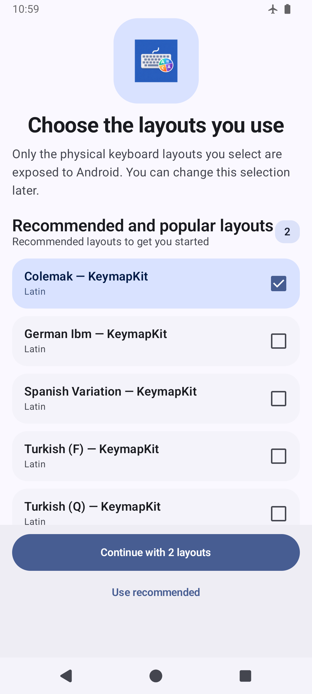
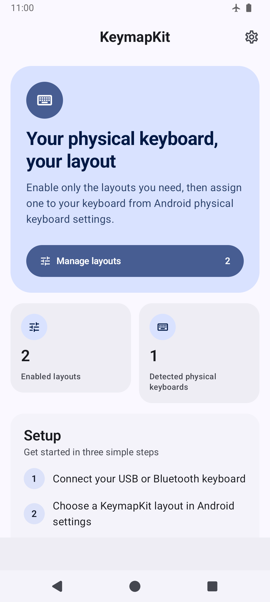
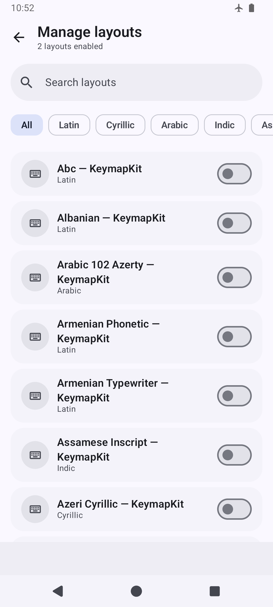
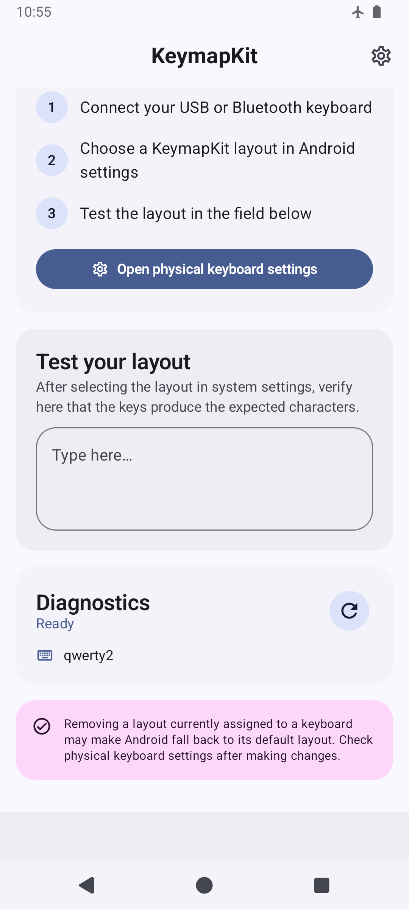

<p align="center">
  
</p>

<p align="center">
  
  
  
  
  
  
  
</p>

<p align="center">
  <a href="https://play.google.com/store/apps/details?id=com.alpware.keymapkit">
    
  </a>
</p>

<h1 align="center">KeymapKit</h1>

<p align="center">
  <strong>Add missing physical keyboard layouts to Android.</strong><br/>
  Lightweight • Offline • No Root • No Permissions • Open Source
</p>

---

## ✨ Why KeymapKit?

Android supports external keyboards, but many useful physical keyboard layouts are missing.

KeymapKit fills that gap by adding **system-level physical keyboard layouts** such as:

- 🇹🇷 Turkish F
- 🇹🇷 Turkish Q
- and many more in future releases.

Unlike traditional keyboard apps:

- ✅ No on-screen keyboard
- ✅ No IME
- ✅ No root
- ✅ No Accessibility Service
- ✅ No permissions
- ✅ Works completely offline

KeymapKit simply provides additional **hardware keyboard layouts** that Android can use.

---

## 📸 Screenshots

<p align="center">
  
  
  
  
</p>

Current screens include:

- Home dashboard
- First-time setup
- Layout Manager
- Typing Test
- Diagnostics
- Material You interface

---

# 🚀 What's New in KeymapKit 2.0

KeymapKit now installs **only the keyboard layouts you actually need**.

### New First-Time Setup

Choose your preferred layouts during the first launch.

For example:

- Turkish Q
- Turkish F
- English US
- German
- French

Only selected layouts become available inside Android.

---

### New Layout Manager

Manage installed layouts anytime.

- Add layouts
- Remove layouts
- Search layouts
- View installed layouts
- Update selections instantly

No reinstall required.

---

### Recommended Layouts

KeymapKit automatically recommends layouts based on your current device language.

Examples:

- Turkish device → Turkish Q + Turkish F
- English device → English US

---

### Typing Test

Verify your selected layout immediately.

No third-party app is required.

---

### Diagnostics

Built-in diagnostics help verify:

- Physical keyboard detection
- Active layouts
- Provider status
- Connected keyboards

---

## ✨ Features

- ✅ System-level physical keyboard layouts
- ✅ Works in every application
- ✅ Dynamic layout installation
- ✅ Layout Manager
- ✅ Typing Test
- ✅ Diagnostics
- ✅ Material 3 / Material You
- ✅ Dark Mode
- ✅ Android 8.0+
- ✅ Lightweight
- ✅ Offline
- ✅ Open Source

---

## 🧠 How It Works

Android supports physical keyboard layouts through `.kcm` (Key Character Map) files.

KeymapKit registers itself as a **Keyboard Layout Provider** and exposes these layouts directly to Android.

Unlike an IME:

- No text input service
- No keyboard replacement
- No accessibility service
- No background process

Android itself performs all key mapping.

---

## 📱 Setup

1. Install KeymapKit
2. Connect a USB or Bluetooth keyboard
3. Launch KeymapKit
4. Select the layouts you want
5. Open:

```
Settings
→ Physical Keyboard
→ Choose KeymapKit layout
```

6. Open the built-in Typing Test
7. Verify everything works

> Samsung devices may require tapping the language entry (for example, "Turkish (Türkiye)") before the available layouts become visible.

---

## 🔒 Privacy

KeymapKit follows a strict privacy-first philosophy.

It contains:

- No permissions
- No analytics
- No advertising
- No tracking
- No accounts
- No internet communication
- No cloud services

Everything works locally on your device.

---

## 🧩 Supported Layouts

Current:

- 🇹🇷 Turkish F
- 🇹🇷 Turkish Q

Planned:

- 🇺🇸 English (US)
- 🇬🇧 English (UK)
- 🇩🇪 German
- 🇫🇷 French
- 🇪🇸 Spanish
- 🇮🇹 Italian
- More community layouts

---

## 🛠 Tech Stack

- Kotlin
- Jetpack Compose
- Material 3
- Material You
- Android Keyboard Layout API
- Kotlin Coroutines

No XML UI.

---

## 🧪 Testing

KeymapKit includes:

- Typing Test
- Diagnostics
- Keyboard detection
- Layout verification

These tools make it easier to validate different USB and Bluetooth keyboards.

---

## 📄 Third-Party Notice

Some keyboard layout definitions (`.kcm`) are derived from:

**More Physical Keyboard Layouts / extra-keyboard-layouts**

Licensed under the MIT License.

See:

```
THIRD_PARTY_NOTICES.md
```

for attribution details.

---

## 📦 Google Play

Download KeymapKit from Google Play:

https://play.google.com/store/apps/details?id=com.alpware.keymapkit

---

## 🤝 Contributing

Contributions are always welcome.

Especially:

- New keyboard layouts
- Documentation
- Generator improvements
- Bug fixes
- Device compatibility reports

Please open an Issue or Pull Request.

---

## 📜 License

Apache License 2.0

---

## 👨‍💻 Developed by

**AlpWare Studio**

---

<p align="center">
<strong>KeymapKit — because physical keyboards deserve proper layouts.</strong>
</p>